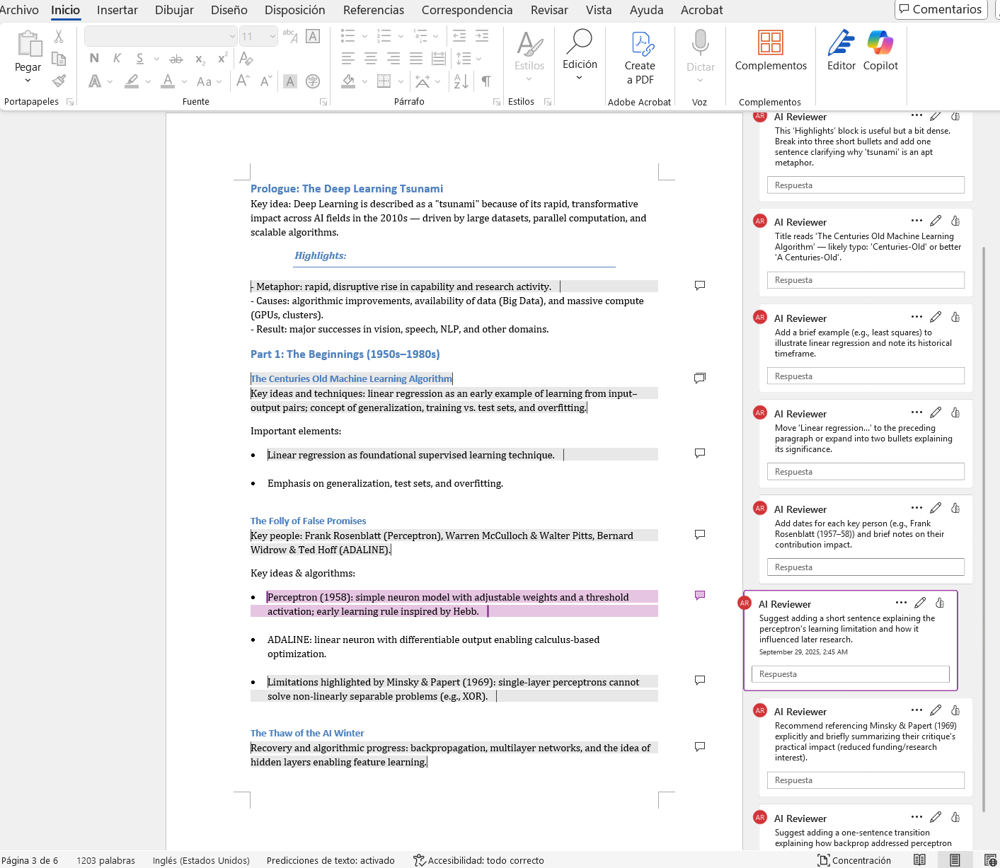
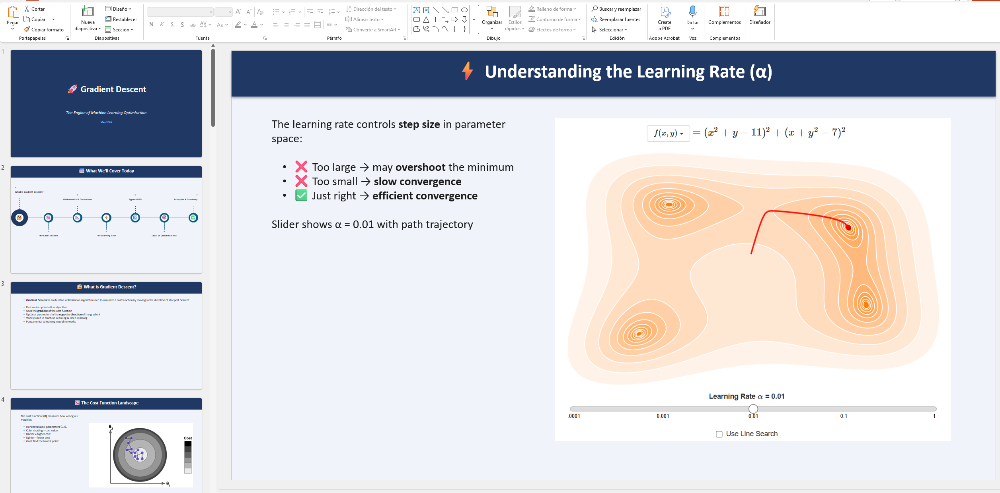

# GenFiles OpenAPI Server 🧩

GenFiles is an OpenAPI server that generates PowerPoint, Excel, Word, or Markdown files from user requests and chat context. It executes Python templates or structured YAML document builders to produce files, uploads them to an Open WebUI endpoint, and can persist them in Open WebUI knowledge collections depending on configuration. Additionally, it supports analyzing and reviewing existing Word documents by extracting their structure and adding comments for corrections, grammar suggestions, or idea enhancements.

Requires **Open WebUI >= 0.9.0**.

## Table of Contents

- [Features](docs/features.md) ✨
  - Highlights the key capabilities of GenFiles.
  - Learn about file generation, OWUI integration, and more.
- [Installation](docs/installation.md) ⚙️
  - Docker-based deployment as an OpenAPI external tool for Open WebUI.
  - Step-by-step setup instructions.
- [Usage Examples](docs/usage.md) 📄
  - See how to generate DOCX, XLSX, PPTX and PDF files.
  - Learn how to review Word documents with AI comments.

> 🚨 Please follow the installation instructions step by step to avoid errors.

## Quick Start [Installation Guide](docs/installation.md)

### Installation

To quickly get started, use the pre-built Docker image:

```bash
docker pull ghcr.io/baronco/genfiles-openapi:v0.4.0-alpha.6
```

Run the container:

```bash
docker run -d --restart unless-stopped -p 8016:8016 \
  -e OWUI_URL="http://host.docker.internal:3000" \
  -e PORT=8016 \
  -e REVIEWER_AI_ASSISTANT_NAME="GenFiles" \
  -e ENABLE_CREATE_KNOWLEDGE=false \
  --name genfiles-openapi \
  ghcr.io/baronco/genfiles-openapi:v0.4.0-alpha.6
```

Or copy and paste this one-liner:

```bash
docker run -d --restart unless-stopped -p 8016:8016 -e OWUI_URL="http://host.docker.internal:3000" -e PORT=8016 -e REVIEWER_AI_ASSISTANT_NAME="GenFilesMCP" -e ENABLE_CREATE_KNOWLEDGE=false --name genfiles-openapi ghcr.io/baronco/genfiles-openapi:v0.4.0-alpha.6
```

### Environment Variables

| Variable                      | Description                                                                                  | Example                            |
|-------------------------------|----------------------------------------------------------------------------------------------|------------------------------------|
| `OWUI_URL`                    | URL of your Open WebUI instance                                                              | `http://host.docker.internal:3000` |
| `PORT`                        | Port where GenFiles will listen                                                              | `8016`                             |
| `KNOWLEDGE_COLLECTION_NAME`   | Name of the Open WebUI knowledge collection used when `ENABLE_CREATE_KNOWLEDGE=true`         | `My Generated Files`               |
| `REVIEWER_AI_ASSISTANT_NAME`  | Author name used inside Word comments created by `review_docx`                               | `GenFilesMCP`                      |
| `ENABLE_CREATE_KNOWLEDGE`     | Whether generated or reviewed files are added to Open WebUI knowledge collections            | `false`                            |
| `ENABLE_STRUCTURED_YAML_MODE` | Enables YAML-based structured generation for Word and PowerPoint            | `true`                             |

> **Open WebUI requirement:** set `ENABLE_FORWARD_USER_INFO_HEADERS=True` in your Open WebUI environment. This makes Open WebUI forward the active user's bearer token to GenFiles so documents are uploaded and reviewed on behalf of the correct user.

> 🚨 **Open WebUI users:** if downloads fail in the chat iframe, enable **Settings → Interface → Artifacts → iframe Sandbox Allow Same Origin** in Open WebUI.

For more detailed installation instructions, see the [Installation Guide](docs/installation.md).

## What Can It Do?

- Generate files in multiple formats (PowerPoint, Excel, Word, Markdown).
- Review Word documents with AI-generated comments for grammar and idea enhancements.
- Integrate seamlessly with Open Web UI for file uploads and knowledge management.

> **Authoring instructions:** The detailed, per-file-type authoring instructions live in the
> [`src/`](src/) folder as markdown templates (one per tool/mode: word, word YAML, powerpoint,
> powerpoint YAML, excel, pdf, markdown, plus the Word review and file-fetch helpers). They are
> loaded by `load_md_templates` and served as each tool's OpenAPI **description**, so the model
> receives the full script template / YAML schema / review workflow directly when it inspects the
> tool — no separate skill-loading step is required.

### Examples of Generated Files 📄

#### DOCX Files 📝

- **Code-based generation**: The LLM writes Python code to generate the document.
- **Template YAML based generation**: The LLM defines the structure, and the backend builds the document (best results with Claude Haiku 4.5 and Kimi K2.5, 5.0/5).

<p align="center">
  
</p>

- **Reviewer Mode**: Add comments for grammar and idea enhancements.

<p align="center">
  
</p>

#### PPTX Files 📊

The latest GPT models can generate PowerPoint files with good structure and formatting. You can try gpt-5.2 or gpt-5.4 for best style and formatting results.

<p align="center">
  
</p>

Example using gpt 5.4:

<p align="center">
  
</p>

This server also supports template YAML-based PPTX generation, where the model emits a structured YAML document and the backend builds the slide deck from it. Example using DeepSeek V4 Flash:

<p align="center">
  
</p>

> Note: the DeepSeek V4 Flash example below was generated as a PPTX image preview, but DeepSeek V4 Flash does not receive images directly. Use Open Web UI filters to add vision capabilities and supplement the model with uploaded images.

#### XLSX Files 📈

The server can generate Excel files with multiple sheets, tables, and charts. The quality of formatting and structure depends on the model used, with the latest GPT models producing the best results.

<p align="center">
  
</p>

Example using gpt 5.4:

<p align="center">
  
</p>

#### PDF Files 📚

Example of PDF generation using gpt 5.4:

<p align="center">
  
</p>

Example of PDF generation using claude sonnet 4.6:

<p align="center">
  
</p>

## Star History

[](https://www.star-history.com/#Baronco/GenFilesMCP&type=date&legend=top-left)

## License

This project is licensed under the MIT License - see the [LICENSE.md](LICENSE.md) file for details.
